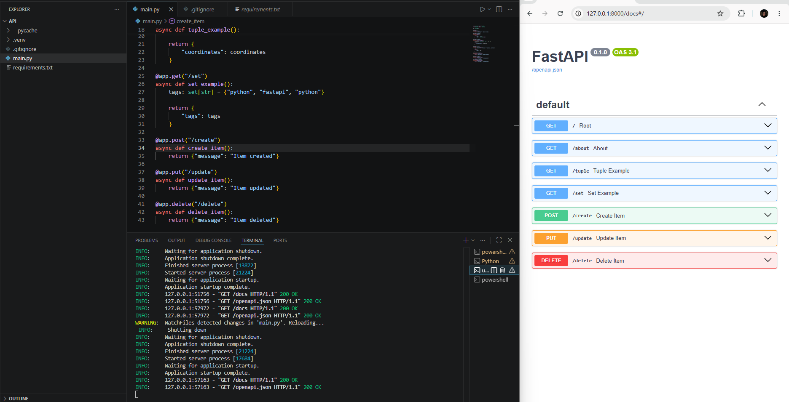

# FastAPI Project

Simple FastAPI practice project using Python and VSCode.

## Installation

Create virtual environment:

```bash
python -m venv .venv
```

## Activate virtual environment

```bash
.venv\Scripts\activate
```

## Install dependencies

```bash
pip install -r requirements.txt
```

## Run server

```bash
uvicorn main:app --reload
```

## Open in browser

http://127.0.0.1:8000

## Swagger Docs

http://127.0.0.1:8000/docs

## Technologies

- Python 3.11.9
- FastAPI
- Uvicorn


