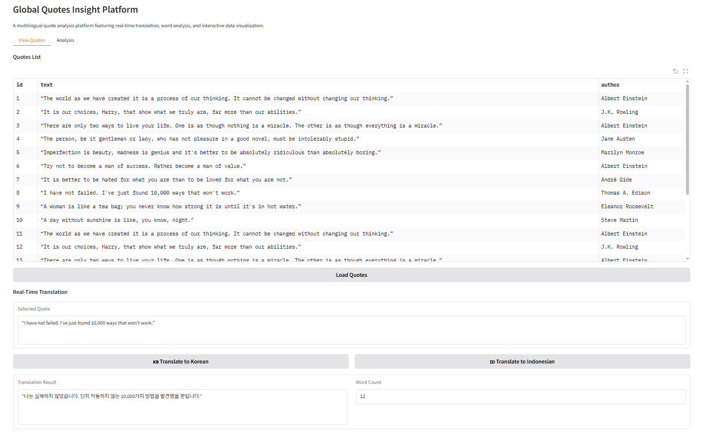
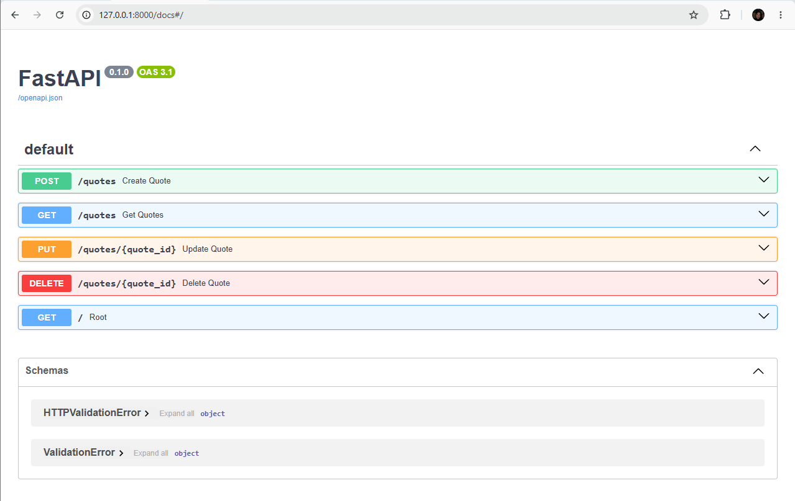

# Quotes Management and Analysis System

## 📌 Project Overview
This project is a web-based quote management and analysis system developed using:

- FastAPI
- Gradio
- SQLite3
- Hugging Face Spaces

The system collects quote data, stores it in a database, provides CRUD APIs, and offers analysis and translation features through an interactive web UI.

---

# Project Files

| File | Description |
|---|---|
| `app.py` | Main Gradio web application |
| `main.py` | FastAPI CRUD API |
| `crawler.py` | Quote crawling script |
| `database.py` | Database creation & management |
| `quotes.db` | SQLite database |
| `requirements.txt` | Required Python packages |

---

# Main Features

- Quote data collection and storage
- FastAPI CRUD API
- Interactive Gradio UI
- Korean translation 🇰🇷
- Indonesian translation 🇮🇩
- Word count analysis
- Hugging Face deployment

---

## User Interface

Interactive Gradio-based web interface for quote exploration, translation, and analysis.

## API Documentation

FastAPI Swagger UI for CRUD operations:

- Create Quote
- Read Quote
- Update Quote
- Delete Quote

---

# Deployment

### MAIN UI
https://huggingface.co/spaces/salsabilaslh/app.project

### FASTAPI DOCS
https://salsabilaslh-app-project.hf.space/docs
